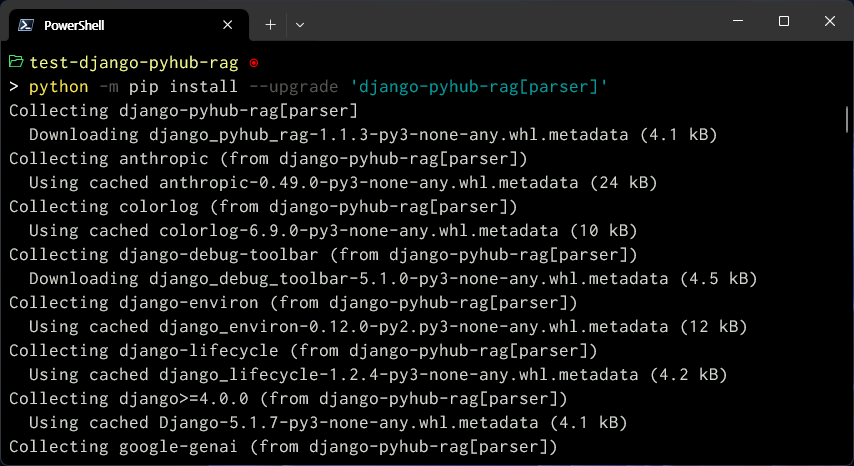
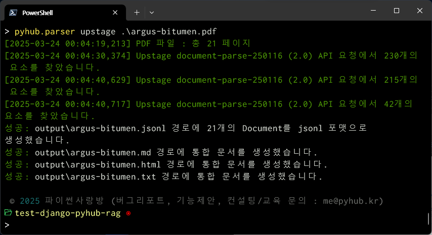
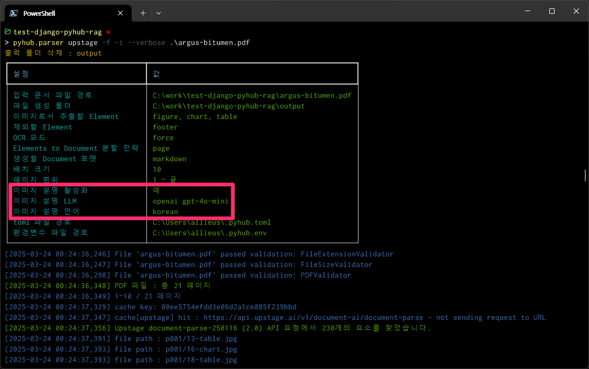
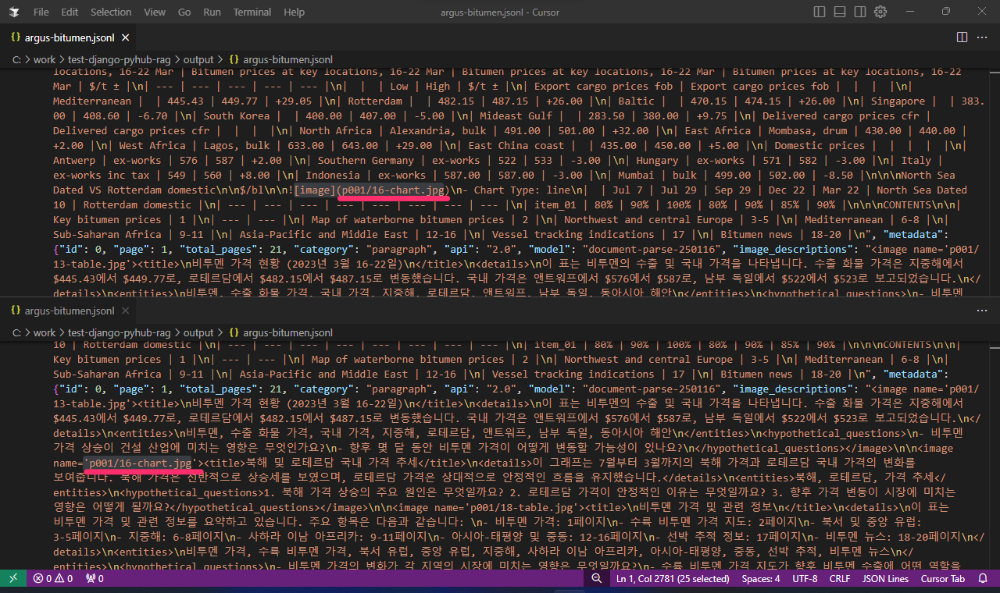
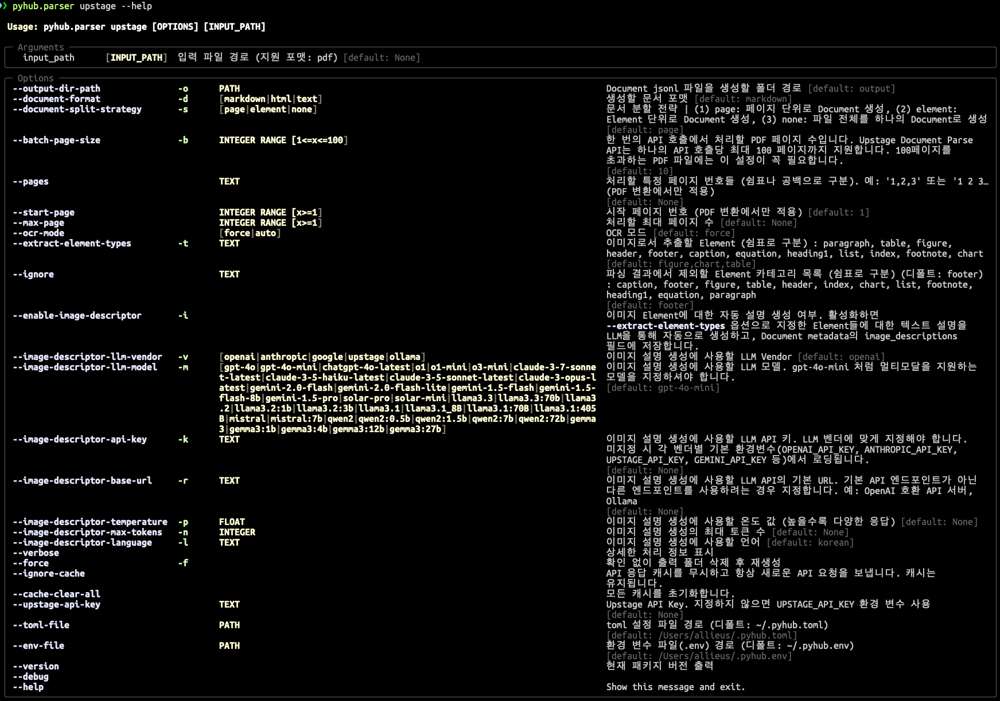

---
search:
  boost: 2
---

# 명령 한 방에 PDF 변환하기

## API Key 획득 및 저장

PDF 파싱을 위해 Upstage API Key와 이미지 설명 생성을 위해 OpenAI API Key를 먼저 획득해주세요.

<div class="grid cards" markdown>

- <a href="https://console.upstage.ai/api-keys">Upstage API 키 얻기</a>

    ---

    가입하시면 웰컴 쿠폰으로 `$10`을 받으실 수 있습니다. 1페이지 변환에 `$0.01` 비용이 부과되므로 1,000장을 변환하실 수 있습니다.

    `UPSTAGE_API_KEY` 환경변수로서 저장해주세요.

- <a href="https://platform.openai.com/api-keys">OpenAI API 키 얻기</a>

    ---

    이미지에 대한 설명을 작성할 때, 디폴트로 `openai`, `gpt-4o-mini` 모델을 사용합니다.

    `OPENAI_API_KEY` 환경변수로서 저장해주세요.

- <a href="https://console.anthropic.com/settings/keys">Anthropic API 키 얻기</a>

    ---

    이미지 설명 작성할 때, `-v anthropic` 옵션을 지정하면 `-m` 옵션으로 anthropic 모델을 지정하여 사용할 수 있습니다.

    `ANTHROPIC_API_KEY` 환경변수로서 저장해주세요.

- <a href="https://ai.google.dev/gemini-api/docs/api-key">Google Gemini API 키 얻기</a>

    ---

    이미지 설명 작성할 때, `-v google` 옵션을 지정하면 `-m` 옵션으로 google gemini 모델을 지정하여 사용할 수 있습니다.

    `GOOGLE_API_KEY` 환경변수로서 저장해주세요.

</div>

획득하신 각 Key는 `~/.pyhub.env` (윈도우: `c:\Users\사용자명\.pyhub.env`) 경로에 저장하시면 유틸리티에서 환경변수로서 추가로 읽어갑니다.

``` title="~/.pyhub.env"
UPSTAGE_API_KEY=up_...
OPENAI_API_KEY=sk-...
```

`~/.pyhub.env` 가 아니라 시스템/유저 환경변수로 등록되어있어도 동작합니다.


## 가상환경 생성 및 활성화 

다른 라이브러리와 충돌을 막기 위해, 가상환경을 먼저 생성하시고 활성화해주세요.


## 라이브러리 설치

가상환경에 `django-pyhub-rag[parser]` 라이브러리만 설치해주시면 됩니다.

```
python -m pip install --upgrade 'django-pyhub-rag[parser]'
```



## 설치 확인

라이브러리가 정상적으로 설치되셨다면, 다음 3가지 방법으로 `pyhub.parser upstage` 명령을 실행하실 수 있습니다.

```
# 실행 방법 #1
pyhub.parser upstage --help

# 실행 방법 #2
# 환경변수 PATH 이슈가 있으실 경우, pyhub.parser 명령을 못 찾으실 수 있습니다.
# 그럴땐 이렇게 해보세요.
python -m pyhub.parser upstage --help

# 실행 방법 #3 : uv를 활용하실 경우
uv run -m pyhub.parser upstage --help
```


그리고, 변환할 PDF 파일을 하나 준비해주세요.

+ [Argus Bitumen](https://www.argusmedia.com/en/solutions/products/argus-bitumen)는
  전 세계 비트멘(아스팔트) 시장에 대한 가격 평가, 뉴스, 시장 분석을 제공하는 주간 서비스입니다
  사이트의 Related documents 메뉴에서 Sample Report, Download now 링크를 통해 샘플 보고서 [argus-bitumen.pdf](https://www.argusmedia.com/-/media/project/argusmedia/mainsite/english/documents-and-files/sample-reports/argus-bitumen.pdf?rev=7512cf07937e4e4cbb8889c87780edf7)를 다운받으실 수 있는 데요.
  매 페이지마다 상하단에 header/footer가 있고 **2단 컬럼** 구조이며, 표와 이미지가 포함된 복잡한 PDF 문서입니다.


## 첫 변환

PDF 파일 경로를 지정하시면 즉시 PDF 문서 파싱이 수행되고 `./output/` 경로에 jsonl 파일 및 추출된 이미지 파일이 저장됩니다.

```
pyhub.parser upstage ./argus-bitumen.pdf
```



명령이 성공적으로 수행되었습니다.


이때 `UPSTAGE_API_KEY`에 문제가 있다면 다음의 에러 메시지를 만나시게 됩니다.
`~/.pyhub.env` 파일에서 `UPSTAGE_API_KEY` 설정을 확인해주세요. 등호 `=` 앞 뒤로 절대 띄워쓰기를 쓰시면 안 됩니다.
혹은 `upstage` 명령에서 `--upstage-api-key` 인자로 API Key를 지정하실 수도 있습니다.

```
문서 파싱 실패: 401 - {"error":{"message":"API key is invalid, please check out our API reference page
(https://console.upstage.ai/docs/getting-started/overview)","type":"invalid_request_error","param":"","code":"invalid_api_key"}}
```

`output/` 폴더 경로에

+ `chart`, `figure`, `table` 각 폴더에 Upstage Document Parse로부터 추출된 이미지가 모두 저장되며
+ `argus-bitumen.jsonl` (PDF 파일명을 따릅니다.) 경로에 Vector Store에 즉시 저장하실 수 있도록 `Document(page_content, metadata)` 포맷의 `jsonl` 파일로 생성되며,
    - 디폴트로 PDF 페이지 단위로 묶어서 `Document`가 생성되며, `--document-split-strategy` (`-s`) 옵션을 `element`로 지정하시면
      Update Document Parse에서 생성해준 Element 단위로 `Document`가 생성됩니다.
+ 그리고, 통합문서로서 `.md`, `.html`, `.md` 문서가 자동 생성되며, `.md`, `.html` 파일에는 이미지 링크가 자동으로 걸립니다.


생성된 `./output/argus-bitumen.jsonl` 파일의 `metadata`는 아래와 같습니다.

```markdown
{"page_content": "생략", "metadata": {"id": 0, "page": 1, "total_pages": 1, "category": "heading1", "coordinates": [], "api": "2.0", "model": "document-parse-250116"}}
```


## 수행내역 자세히 보기

`--verbose` 옵션을 적용하시면, 각종 설정 및 수행내역을 자세히 확인하실 수 있습니다.


## 이미지 설명 생성하기

`--enable-image-descriptor` (`-i`) 옵션을 추가로 지정하시면, 디폴트로 `OpenAI` `gpt-4o-mini` 모델로 이미지 설명을 생성해줍니다.
물론 `anthropic`, `google`, `ollama` 등을 통한 이미지 설명을 생성하실 수 있습니다.

```
pyhub.parser upstage -i ./argus-bitumen.pdf
```

아래 스크린샷에서 `-f` 옵션은 `output` 폴더가 있더라도 제거하고 강제로 재생성하는 옵션입니다. `-f` 옵션을 붙이지 않으면 `output` 폴더가 있을 경우
진행유무를 물어봅니다.



`argus-bitumen.pdf` 파일에 대한 `Upstage Document Parse` API가 이미 호출했었기에,
지금 다시 명령을 수행하더라도 `Upstage Document Parse` API 호출을 다시 하지 않고, 로컬에 파일로 캐싱된 API 응답을 활용합니다.
(장고 캐시 프레임워크 활용)

각 이미지에 대해서 `OpenAI`, `gpt-4o-mini` API 호출은 처음이기에, 각 이미지 별로 `OpenAI` API 호출이 순차적으로 이뤄집니다.
수행이 끝나면 아래와 같이 각 이미지 파일과 함께 설명 파일을 확인하실 수 있습니다.


생성된 `.jsonl` 파일에서는 이렇게 이미지 링크가 설명이 잘 생성되어있음을 확인하실 수 있습니다.



디폴트로 로컬 머신에 `upstage`/`openai`/`anthropic`/`google`/`ollama` API 요청 내역을 캐싱합니다.
방금 수행한 `pyhub.parser upstage -i ./argus-bitumen.pdf` 명령을 다시 수행해보시면
캐싱된 내역을 사용하기에 즉시 명령이 종료되고 `output` 폴더 경로에 파일이 재생성됨을 확인하실 수 있습니다.


## 생성된 파일 내역 확인하기

[저장소/samples/argus-bitumen/](https://github.com/pyhub-kr/django-pyhub-rag/tree/main/samples/argus-bitumen) 폴더에서 생성된 jsonl, md, html, text 및 이미지/설명을 확인하실 수 있습니다.


## help

보다 자세한 옵션은 `--help` 도움말을 참고해주세요.




## 감사합니다. :smile:

!!! tip

    장고로 만들어진 유틸리티 혹은 API 서버를 AI 에이전트 시스템을 위한 데이터 전처리 전용 웹서비스로 만드시는 것은 어떠신가요?
    랭체인, 라마인덱스, 스프링 등의 서비스에서 손쉽게 변환된 데이터를 가져가실 수 있습니다.
    `django-pyhub-rag` 라이브러리와 함께 만들어가보시죠. 😉
