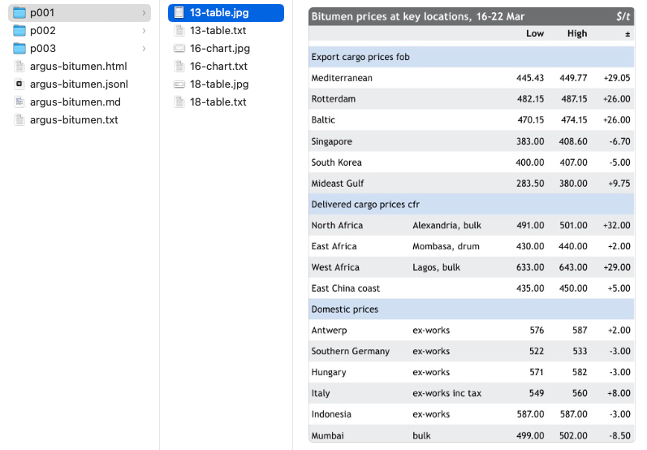

# 릴리즈 노트

## 1.0.6

+ `metadata['page']`에 전체 페이지 주소를 반영

## 1.0.5

+ `pyhub.parser upstage` 명령 : `metadata["source"]` 항목에 PDF 파일명 추가

## 1.0.4

+ `openai`, `google`, `ollama` embed api에 대한 캐싱 지원

## 1.0.3

+ 이미지 파일명 패턴 변경
    - 기존 : `category/id.jpg`
    - 변경 : `p페이지번호/id-category.jpg`

## 1.0.2

+ `--batch-page-size` 옵션(`-b`)을 다시 살려서, PDF 파일을 지정 단위로 끊어서 업스테이지 Document Parse API를 호출합니다.

## 1.0.1

+ API 벤더 (upstage, openai, anthropic, google, ollama) 별로 캐시 스토리지를 분리하여, 최대 개수를 API 별로 관리합니다.
  캐싱된 개수가 5,000개가 되면 1/5이 제거됩니다.
+ `pyhub.parser upstage --cache-clear-all` 옵션으로 모든 캐시를 초기화합니다.
